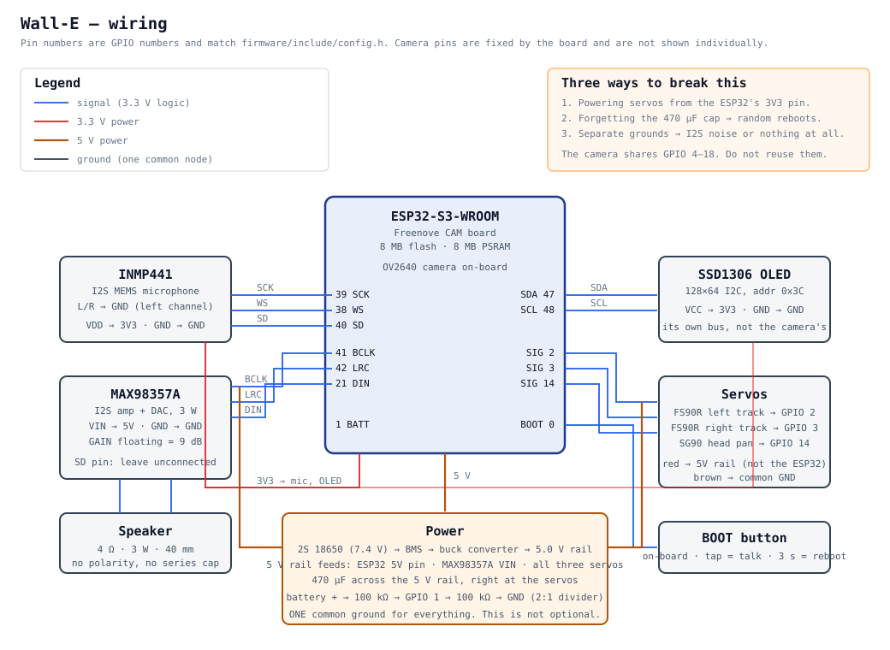

# Wiring



Every pin number below is a **GPIO number** and matches
[`firmware/include/config.h`](../firmware/include/config.h). If you change one,
change it there — nothing else in the firmware hard-codes a pin.

## Pin map

### Microphone — INMP441 (I2S peripheral 0)

| INMP441 | ESP32-S3 | Notes |
|---|---|---|
| VDD | 3V3 | Not 5 V. This part is 3.3 V only. |
| GND | GND | |
| SCK | GPIO 39 | Bit clock |
| WS | GPIO 38 | Word select / LR clock |
| SD | GPIO 40 | Data out of the mic, into the ESP32 |
| L/R | **GND** | Ties the mic to the left channel, which is what the firmware reads |

Leaving L/R floating is the single most common cause of "the mic returns
silence". It must go to GND.

### Speaker — MAX98357A (I2S peripheral 1)

| MAX98357A | ESP32-S3 | Notes |
|---|---|---|
| VIN | **5 V** | From the buck converter, not the 3V3 pin |
| GND | GND | |
| BCLK | GPIO 41 | |
| LRC | GPIO 42 | |
| DIN | GPIO 21 | |
| GAIN | *leave floating* | 9 dB. Tie to GND for 12 dB if you want it louder. |
| SD | *leave floating* | Pulled high internally = always on |
| + / − | Speaker | 4–8 Ω. No polarity, no series capacitor. |

Two separate I2S peripherals is why the robot can listen and speak at the same
time, which is what makes barge-in possible.

### Display — SSD1306 OLED

| OLED | ESP32-S3 |
|---|---|
| VCC | 3V3 |
| GND | GND |
| SDA | GPIO 47 |
| SCL | GPIO 48 |

This is a **separate I2C bus** from the camera's SCCB lines (GPIO 4/5). Do not
share them — the camera driver reconfigures that bus and your face will freeze.

If the display stays blank, the address is the usual culprit: most modules are
`0x3C`, some are `0x3D`. Change `OLED_I2C_ADDR` in `config.h`.

### Servos

| Servo | Signal | Power |
|---|---|---|
| Left track (FS90R, continuous rotation) | GPIO 2 | 5 V rail |
| Right track (FS90R, continuous rotation) | GPIO 3 | 5 V rail |
| Head pan (SG90, standard 180°) | GPIO 14 | 5 V rail |

Servo red wires go to the **5 V rail**, never to the ESP32's 3V3 pin. A stalled
FS90R pulls close to an amp; the ESP32's regulator will shut down long before
that and you will spend an evening blaming your Wi-Fi.

### Battery sensing

```
BATT+ ──[100 kΩ]──┬──[100 kΩ]── GND
                  │
               GPIO 1 (ADC1_CH0)
```

A 2:1 divider, so a 8.4 V full pack reads 4.2 V — comfortably inside ADC1's
range with 12 dB attenuation. If you use different resistors, update
`BATTERY_DIVIDER_RATIO` in `config.h`.

Use ADC**1** pins only (GPIO 1–10). ADC2 shares hardware with the Wi-Fi radio
and returns garbage whenever the radio is active.

### Camera

The OV2640 is wired on the board. It occupies GPIO 4, 5, 6, 7, 8, 9, 10, 11,
12, 13, 15, 16, 17 and 18. **Do not reuse any of them.** They are listed in
`config.h` under "camera pins (fixed)" so you can see at a glance what is taken.

### Button

The board's BOOT button is on GPIO 0 with an internal pull-up. The firmware
uses it for push-to-talk (tap) and reboot (hold 3 s). No extra wiring.

## Power

```
2S 18650 pack (6.0–8.4 V)
   │
   ├── BMS / balance charger
   │
   └── buck converter, set to 5.00 V BEFORE connecting anything
          │
          ├── ESP32-S3  5V pin
          ├── MAX98357A VIN
          └── all three servos
```

Three things that are not optional:

1. **Set the buck converter's output voltage before you connect the ESP32.**
   These boards ship at whatever the last person left the trimmer at. Measure
   it. 6 V will destroy the board.
2. **470 µF across the 5 V rail, physically close to the servos.** Servos draw
   current in sharp pulses; without bulk capacitance those pulses drop the rail
   far enough to reset the ESP32. If your robot reboots whenever it moves, this
   is why.
3. **One common ground.** Battery negative, buck ground, ESP32 GND, mic GND, amp
   GND, servo browns — all one node. I2S is a synchronous protocol and a ground
   offset of a few hundred millivolts turns clean audio into noise.

USB-only builds skip all of this: plug the board into a USB port and connect the
servos' red wires to the board's 5 V pin. A USB 3 port supplies plenty for three
micro servos that only run in short bursts.

## Bench bring-up order

Do not wire everything and then power it on. Build it up in stages, and flash
the `walle-minimal` environment first — it disables the camera, the motors and
the wake word so there is less to go wrong:

```bash
cd firmware && pio run -e walle-minimal -t upload && pio device monitor
```

1. **Board alone.** Confirm it boots and joins Wi-Fi. The serial log prints the
   IP address.
2. **Add the OLED.** You should get a face. If not, it is the address or SDA/SCL
   are swapped.
3. **Add the microphone.** Tap BOOT and watch the level meter move when you
   speak. `[voice] listening` appears in the log.
4. **Add the amplifier and speaker.** You should hear the two-tone wake chirp
   when you tap BOOT.
5. **Add the servos**, one at a time, on external 5 V. Trim `SERVO_LEFT_STOP_US`
   and `SERVO_RIGHT_STOP_US` until the tracks are genuinely still at idle —
   continuous-rotation servos are never exactly centred at 1500 µs.
6. **Switch to the full build** (`pio run -t upload`) to bring up the camera and
   the wake word.

Each stage takes two minutes and saves an hour of staring at a robot that does
nothing.

## Troubleshooting

| Symptom | Cause |
|---|---|
| Mic returns silence | L/R pin not tied to GND; or SD wired to the wrong GPIO |
| Audio is noisy or buzzes | Grounds not common; or the mic wires run alongside servo wires |
| Robot reboots when it moves | Missing 470 µF; or servos on the 3V3 rail |
| OLED blank | Wrong I2C address (`0x3C` vs `0x3D`); or SDA/SCL swapped |
| OLED freezes when the camera runs | OLED is sharing the camera's SCCB bus — move it to 47/48 |
| Camera init fails | PSRAM not enabled — check `-DBOARD_HAS_PSRAM` is in `build_flags` |
| Tracks creep when idle | Trim `SERVO_*_STOP_US`, a few µs at a time |
| One track runs backwards | Flip `SERVO_LEFT_INVERT` or `SERVO_RIGHT_INVERT` |
| Battery reads 0 mV | Divider on an ADC2 pin — it must be GPIO 1–10 |
